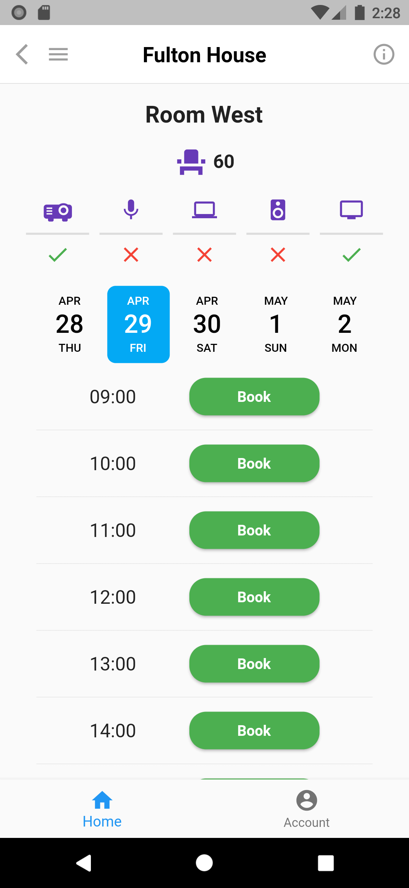
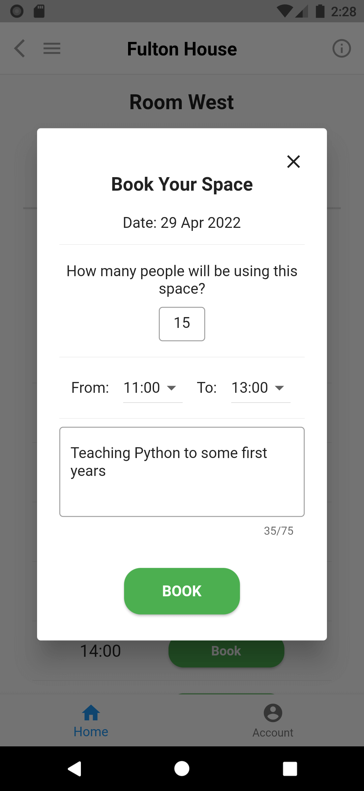
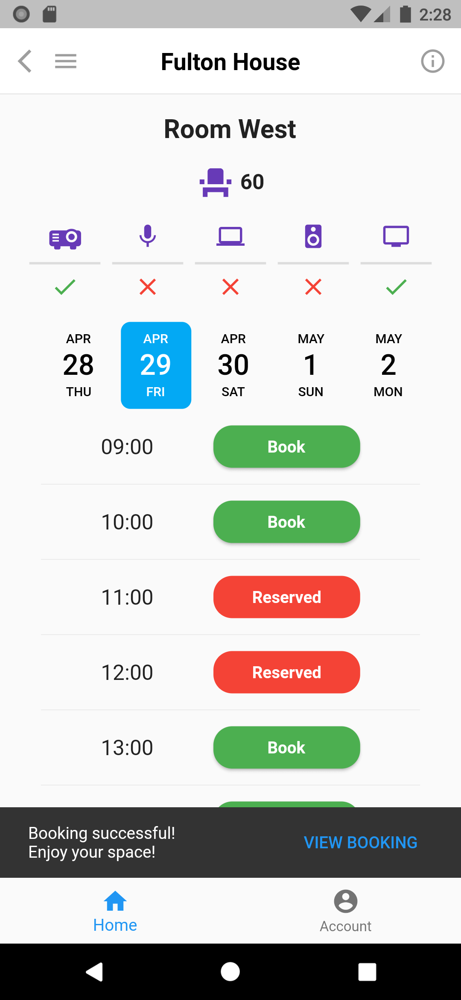
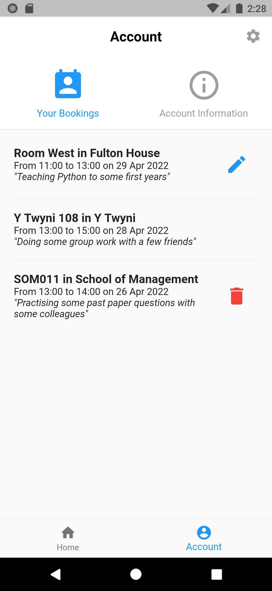

# YourSpace (Meeting Room Booking Application) - Mobile Client

A mobile application that enables users to discover, book, and manage university meeting rooms through a real-time scheduling interface.

Built with Flutter to provide cross-platform mobile access for Android and iOS users, ensuring consistent, mobile-first availability for students and staff who rely on phones for real-time room booking.

## Related Resources

- ⚙️ **YourSpace Backend:** [github.com/dmmkimani/your-space-server](https://github.com/dmmkimani/your-space-server)
- 🌐 **Product-Level Walkthrough:** [dmmkimani.com/your-space](https://dmmkimani.com/projects/your-space)

## Problem Context

Meeting room bookings at Swansea University were handled via email, creating:
- delayed confirmations
- lack of visibility into availability
- manual administrative overhead
- inability to act on “instant availability” (e.g. empty rooms observed in real time)

Room-mounted tablets partially mitigated visibility issues by displaying schedules for a subset of rooms, but lacked scalability across all spaces, remote access, and direct booking capability.

The system required a unified, actionable booking layer.

## System Overview

The mobile client serves as a thin interaction layer, rendering room availability in real time and translating user actions into API requests, while deferring all booking logic and state authority to the backend.

  
  
  
   
   
  
   
   
  <strong>Making and Managing Bookings</strong> 
  <em>(click to view full size)</em>

## Core Design Decisions

#### 1. Runtime UI Generation

Buildings and rooms are rendered dynamically based on backend data rather than static screens.

This enables:
- scalable support for new rooms/buildings
- zero UI changes when backend data changes

**Trade-off:** Shifts structural validation to runtime, reducing compile-time safety and increasing susceptibility to UI failures when backend data is inconsistent or malformed.

#### 2. Centralised Service Layer

A shared service abstraction handles:
- request construction
- API communication
- response handling
- UI-triggered state updates

This prevents API logic from leaking into UI components.

#### 3. Slot-Based Availability Model

Room availability is represented as three states:
- available
- reserved (booked by a user)
- unavailable (not open for booking)

This simplifies UI rendering into a deterministic state-to-view mapping, reducing ambiguity in booking status interpretation.

## Impact on Booking Workflow

- Runtime-generated navigation replacing static structures, enabling **dynamic discovery of buildings and rooms without UI changes** as spatial entities are added or modified.
- Real-time booking state synchronisation with server authority, ensuring **users see only validated availability** and eliminating divergence from actual room state.
- **Multi-step email workflows compressed into a single in-app interaction**, reducing booking completion from async communication cycles to immediate transactional execution.
- **Reduced booking management friction by replacing email-based modification requests with direct in-app amend and cancel operations**, enabling immediate self-service updates.

## Technology Stack

**Client:** Flutter
 
**Platform:** Android, iOS
